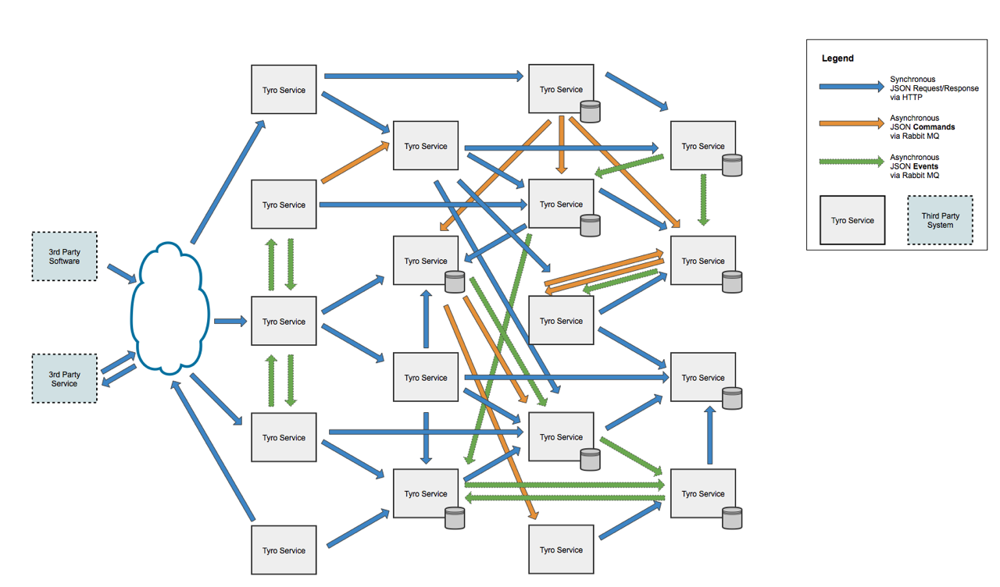

## Security in the Micro-Services Architecture
#### SR - Seminar

<small>Created by <a href="http://lucar.in">Luca Rinaldi</a></small>


## Agenda
- introduce microservice and its characteristics
- explain the main security problem
- present a Security-as-a-Service approach for microservice
- conclusion


## Same Definition
A **Monolithic software application** is a software application
composed of modules that are not independent from the application to which they belong.

A **Microservice** is a minimal independent process interacting via messages.

A **Microservice Architecture** is a distributed application where all its modules are microservices.


## Microservice Architecture
The communication  is made by RESTful API or message broker services.

Each microservices is completely autonomous and domain specific.

The microservices can be deployed as a single machine, virtual machine, container or a process.


### Advantages
- Composability
- Scaling
- Resilience
- Technology Heterogeneity
- Ease of Deployment


### Introduced problems ( Disadvantages )
- Increased Resource use
- Increase Network communication
- Marshalling and Un-marshalling
- Network Security

note:
- **Increased Resource** use - Initial investment to run these applications are high because all the independently running components need their own runtime containers with more memory and CPU.

- **Increase Network communication** - Independently running components interact with each other over a network. Such systems require reliable and fast network connections.

- **Marshalling and Un-marshalling** - When one component needs data from another component, the sender marshals the data in some standard from its internal representation, while the receiver un-marshalls data into its own representation before use. This definitely requires more processing compared to conventional application architecture.

- **Network Security** - Inter Service Communication needs to be secured to avoid any inter communication security breach. Due to several moving parts, these applications are more prone to security vulnerabilities.


## Real-World Examples: [Hail](https://www.hailoapp.com)


## Security issue
- Authentication and Authorization
- Greater Surface Attack Area
- Heterogeneity
- Network Complexity
- Secure the communications
- Trust


### Authentication and Authorization
 

Each micro-services have to ensure that the request is made by an authenticated client with the correct rights.

To avoid repeated work the it can be used SSO Gateway that is the only one that communicate with the identity service.

note:
see: https://speakerdeck.com/dsyer/security-for-microservices-with-spring


### More in detail
There is not an actual standard, but the main idea is to use a token system

The most used technologies are:
- JWT, a token system
- OpenID, decentralized authentication protocol
- OAuth, a delegation protocol


### Greater Surface Attack Area
In the microservice infrastructure all services expose independent API from the programming language.

This services can in principle be access by the external


### Heterogeneity
The application can be made by a very large number of services that can also not be know in advance.

No common security infrastructure, different Trusted Computing Base


### Network Complexity
The architecture bring difficulty in debugging, monitoring, auditing, and forensic analysis of the entire application.

Attackers could exploit this complexity to launch attacks against applications.


### Secure the communications
Are needed way to ensure that the communication between the services are secure.

Adopted technology:
- HTTPS
- Client Certificates
- HMAC Over HTTP


### Trust
We can't consider a microservice trustworthy.

 <!-- .element: style="max-width: 500px;" -->

Encrypt and certificate the communication is not enough, because a compromised service cant act against us.


### Confused deputy problem
The situation where a malicious party can trick a deputy service into making calls to a downstream service on his behalf
that he shouldn’t be able to.


### Netflix vulnerability
As a real world example, a subdomain of Netflix was compromised, and from that domain, adversary can serve any content in the context of netflix.com. In addition, since Netflix allowed all users’ cookies to be accessed from any subdomain, an adversary controlling a subdomain was able to tamper with authenticated Netflix subscribers and their data.


## Security-as-a-Service
In the paper "Security-as-a-Service for Microservices-Based Cloud Applications" is proposed a solution to monitor and analyses microservice requests to ensure same communication policy.


### The DVD retail examples


### One possible problems


a compromised `Contract-Update` may send modified requests to `User-Update` to cause user account to be arbitrarily charged. A compromised `DVD-Update` service may consume and then delete messages on the queue without actually shipping out DVDs, causing a denial of service attack, and so on.


### Monitor the network
The solution have to have this characteristics:
- Completeness
- Tamper
- Flexibility
- Efficiency

note:
- Completeness: the solution should be able to monitor and enforce over both internal and external network events of a cloud application.
- Tamper resistance: the solution should work even if individual application VMs are under adversary’s control.
- Flexibility: the solution should allow applications to specify their own policies over the kind of network events they want to monitor and enforce policies on.
- Efficiency: the solution should have minimal impact on network and CPU resources consumed.


### Design
Put the monitoring part outside the business logic.
Create security VM that can analyses and monitoring the flow coming from the application VM.

All the network event of the services can be redirect by the SDN of the cloud infrastructure.

note:
this solution is tamper-prof because the attacker can't access the security VM unless there is same vulnerability in the VM hypervisor.


### FlowTap Primitive
To avoid custom network configuration is possible to define a new primitive:
```
FlowTap (SRC, DST, Flow_Syntax, Action)
```

- **SRC**, the port of the source VM
- **DST**, the port of the destination VM
- **Flow_Syntax**, identifies a specific flow to tap  
- **Action**, forwarding or redirect

Flow_Syntax Example ( Monitor incoming HTTP requests ):
```(python)
nw_src = 0.0.0.0/0; nw_proto = TCP; tp_dst = 80 , redirect)
```

note:
- **forwarding**: relevant network events will be copied and forwarded to the security VM, with the original network events still delivered to their intended destination.
- **redirecting**: the relevant network events will be directed to the security VM, and depending the decisions made by security monitor, the network events may or may not reach the their intended destination.

Flow_Syntax:
```
in_port, dl_vlan, dl_vlan_pcp, dl_src, dl_dst, dl_type, nw_src,
nw_dst, nw_proto, nw_tos, nw_ecn, nw_ttl, tp_src, tp_dst,
icmp_type, icmp_code, table, metadata, vlan_tci, ip_frag,
arp_sha, arp_tha, ipv6_src, ipv6_dst, ipv6_label, nd_target,
nd_sll, nd_tll, tun_id, tun_src, tun_dst, reg
```


### ftc compiler
A tool to translate the policy written in Dalog to a set of FlowTap call.

It can also dynamically compile the same policy into different set of FlowTap calls that maximize the efficiency of the system, base on CPU usage and network load.

note:
Datalog is a declarative logic programming language that syntactically is a subset of Prolog. It is often used as a query language for deductive databases. In recent years, Datalog has found new application in data integration, information extraction, networking, program analysis, security, and cloud computing.


### Implementation
FlowTap is implemented on OpenStack Icehouse release.

By modifying the virtual routing devices on cloud nodes:
- the integration bridge (`br-int`) that connects to VMs
- the tunneling bridge (`br-tun`) that tunnels the VM traffic across cloud nodes.


### How it works
modified `br-int` such that when a packet of the target VM is submitted, it is processed through
the following steps according to the FlowTap API:
1. the flow is compared with the flow syntax;
2. if it matches, it is duplicated (if the action is forwarding) or taken as it is (if the action is redirecting);
3. its destination MAC address is rewritten to be the MAC of the security VM;
4. it is resubmitted to either a local port on `br-int` if the security VM is on the same cloud node, or to the `br-tun` for tunneling.


### Evalutation

<small>

| Scenario        |  (a) |  (b) |  (c)  |  (d)  |
|:----------------|:----:|:----:|:-----:|:-----:|
| Baseline (mbps) | 2600 | 2600 | 12000 | 12000 |
| FlowTap (mbps)  | 2100 | 2600 | 5100  | 9100  |
| Throughput loss | 19%  | 0%   | 57%   | 24%   |

</small>


### Netflix Fido
Application-based security approaches, such as in Netflix Fido analyze API-level behaviors within cloud applications to build application profiles and then use the profiles to detect anomalous patterns.

They, however, have two drawbacks:
- the analysis often uses hooks within the VM or the application to monitor the APIs and other application behaviors. If an adversary successfully compromises a microservice and escalates the privileges to control the VM that hosts the service, it can easily subvert the security of this framework.
- this approach usually lacks the visibility into the underlying infrastructure, thus may lack capability to respond to the conditions (e.g. they cannot redirect traffic by themselves and need some infrastructure support).

note:
Application-based security approaches, such as in Netflix Fido analyze API-level behaviors within cloud applications to build application profiles and then use the profiles to detect anomalous patterns. They, however, have two drawbacks. First, the analysis often uses hooks within the VM or the application to monitor the APIs and other application behaviors. If an adversary successfully compromises a microservice and escalates the privileges to control the VM that hosts the service, it can easily subvert the security of this framework. Second, this approach usually lacks the visibility into the underlying infrastructure, thus may lack capability to respond to the conditions (e.g. they cannot redirect traffic by themselves and need some infrastructure support).


### Conclusion
The microservice architecture is a style that is increasingly gaining popularity both in academia and in the industrial world.

Its not a totally new approach but actually a improvement of really know infrastructure as OO or SOA.

It is needed, also in the security field, standardization and research to resolve the new problem that raise from this use.


## References
<div style="font-size: 24px;">
- Newman, S., 2015. **Building Microservices.** "O'Reilly Media, Inc."

- Sun, Y., Nanda, S. and Jaeger, T., 2015, November. **Security-as-a-Service for Microservices-Based Cloud Applications.** In 2015 IEEE 7th International Conference on Cloud Computing Technology and Science (CloudCom) (pp. 50-57). IEEE.

- Dragoni, N., Giallorenzo, S., Lafuente, A.L., Mazzara, M., Montesi, F., Mustafin, R. and Safina, L., 2016. **Microservices: yesterday, today, and tomorrow.** arXiv preprint arXiv:1606.04036.

- Nordic APIs. 2016. **How To Control User Identity Within Microservices** | Nordic APIs |. [ONLINE] Available at: http://nordicapis.com/how-to-control-user-identity-within-microservices/. [Accessed 10 July 2016].

- Speaker Deck. 2016. **Security for Microservices with Spring** // Speaker Deck. [ONLINE] Available at: https://speakerdeck.com/dsyer/security-for-microservices-with-spring. [Accessed 10 July 2016].
