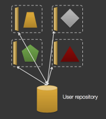

## Security in the Microservice Architecture
#### SR - Seminar

<small><a href="http://lucar.in">Luca Rinaldi</a></small>


## Agenda
- Introduction to microservices

- Security problems in microservices

- Security-as-a-Service approach for microservices

- Conclusions


## Basic Definitions
A **monolithic application** is a software composed of modules that are not independent from the application to which they belong.

A **microservice** is a minimal independent process interacting with others via messages.

A **microservice architecture** is a distributed application where all modules are microservices.


## Microservice Architecture
Communication is performed through **RESTful API** or **message brokering** services.

Each microservice is **autonomous** and **domain specific**.

They can be deployed on a single server, virtual machine, container or process.


### Advantages
- Composability
- Scalability
- Resilience
- Technology agnostic
- Ease of deployment


## Real-World Examples: [Hailo](https://www.hailoapp.com)


## Security issue
- Greater surface attack area
- Heterogeneity
- Network complexity
- Authentication and authorization
- Secure the communications
- Trust


## Greater Surface Attack Area
In the microservice infrastructure all services expose API that are independent from the programming language.

These services can in principle be **accessed by the external**.


## Heterogeneity
The application can be made out of a very **large number of services** that can also be unknown in advance.

No common security infrastructure, different *Trusted Computing Base*.


## Network Complexity
The architecture bring difficulties in debugging, monitoring, auditing, and forensic analysis of the entire application.

Attackers could **exploit this complexity** to attempt attacks against applications.


## Authentication and Authorization
 

Each micro-service has to ensure that the request comes from an authenticated client with the correct rights.

To avoid repeated work an **SSO Gateway** can be used, to login and check users authorization.


### Details
There is no actual standard, but the main idea is to use a **token system**.

The most used technologies are:
- JWT, a token system.
- OpenID, decentralised authentication protocol.
- OAuth, a delegation protocol.


## Secure the communications
The communication between the services should be **secure**.

Adopted technology:
- HTTPS
- HMAC Over HTTP


## Trust
We can't assume a microservice trustworthy.

Encrypt and certificate the communication is not enough, so that a compromised service can't act against us.


### Confused deputy problem
When a malicious party can trick a deputy service into making calls to a downstream service on his behalf that he shouldn't be able to.


### a Netflix vulnerability
A subdomain of Netflix was **compromised** so that an adversary:
- can serve any content in the context of netflix.com.
- was able to tamper authenticated Netflix subscribers and their data.

note:
since Netflix allowed all users cookies to be accessed from any subdomain, an adversary controlling a subdomain was able to tamper with authenticated Netflix subscribers and their data.


## Security-as-a-Service
In the paper "Security-as-a-Service for Microservices-Based Cloud Applications" a solution is proposed  to monitor and analyse microservice requests to ensure some **communication policy**.


## Monitor the network
The solution must have these characteristics:
- Completeness
- Tamper resistance
- Flexibility
- Efficiency

note:
- Completeness: the solution should be able to monitor and enforce over both internal and external network events of a cloud application.
- Tamper resistance: the solution should work even if individual application VMs are under adversary’s control.
- Flexibility: the solution should allow applications to specify their own policies over the kind of network events they want to monitor and enforce policies on.
- Efficiency: the solution should have minimal impact on network and CPU resources consumed.


## Design
Put the monitoring part outside the business logic.

Create a **security VM** that can analyse and monitor the flow coming from the application VM.

All the network events of the application VM can be **redirected** by the SDN of the cloud infrastructure.

note:
this solution is tamper-prof because the attacker can't access the security VM unless there is same vulnerability in the VM hypervisor.


## FlowTap Primitive
To avoid custom network configuration it is possible to define a new primitive:
```
FlowTap (SRC, DST, Flow_Syntax, Action)
```

- **SRC**, the port of the source VM
- **DST**, the port of the destination VM
- **Flow_Syntax**, identifies a specific flow to tap  
- **Action**, forwarding or redirect

Flow_Syntax Example (Monitor incoming HTTP requests):
```(python)
nw_src = 0.0.0.0/0; nw_proto = TCP; tp_dst = 80
```

note:
- **forwarding**: relevant network events will be copied and forwarded to the security VM, with the original network events still delivered to their intended destination.
- **redirecting**: the relevant network events will be directed to the security VM, and depending the decisions made by security monitor, the network events may or may not reach the their intended destination.

Flow_Syntax:
```
in_port, dl_vlan, dl_vlan_pcp, dl_src, dl_dst, dl_type, nw_src,
nw_dst, nw_proto, nw_tos, nw_ecn, nw_ttl, tp_src, tp_dst,
icmp_type, icmp_code, table, metadata, vlan_tci, ip_frag,
arp_sha, arp_tha, ipv6_src, ipv6_dst, ipv6_label, nd_target,
nd_sll, nd_tll, tun_id, tun_src, tun_dst, reg
```


### ftc compiler
A tool to translate the policies written in Datalog to a set of FlowTap call.

It can dynamically compile the policies into different sets of FlowTap calls to **maximise the efficiency** of the system based on CPU usage and network loads.

note:
Datalog is a declarative logic programming language that syntactically is a subset of Prolog. It is often used as a query language for deductive databases. In recent years, Datalog has found new application in data integration, information extraction, networking, program analysis, security, and cloud computing.


## Implementation
FlowTap is implemented on the **OpenStack Icehouse** release.

The following component have been modified:

- The integration bridge (`br-int`) that connects to VMs

- The tunneling bridge (`br-tun`) that tunnels the VM traffic across cloud nodes.


### How it works
The modified `br-int` processes each packet in the following way:

1. It compares the flow with the flow syntax

2. If it matches, the flow is duplicated or taken as is

3. Change the original MAC address with the security VM one

4. re-submit to the `br-int` if the security VM is on the same node, or to the `br-tun` for tunnelling.


## Evaluation

<small>

| Scenario             |  (a) |  (b) |  (c)  |  (d)  |
|:---------------------|:----:|:----:|:-----:|:-----:|
| Baseline (Mbps)      | 2600 | 2600 | 12000 | 12000 |
| FlowTap (Mbps)       | 2100 | 2600 | 5100  | 9100  |
| Throughput reduction | 19%  | 0%   | 57%   | 24%   |

</small>


## Problems of this approach
- It generates a lot of additional network traffic and work.

- It needs an infrastructure implementation *(cloud providers have to adopt it)*.

- Difficulties to deploy the security VM machine in the optimal nodes.

- It cannot tap a specific flow at the Application layer *(reduce check performance)*.

- The management of the security VMs can becomes more complex.


## Conclusion
The microservice architecture is a style that is increasingly gaining popularity both in academia and in the industrial world.

Standardization and research should work to create a more robust infrastructure to build secure and scalable microservices.


## References
<div style="font-size: 24px;">
- Newman, S., 2015. **Building Microservices.** "O'Reilly Media, Inc."

- Sun, Y., Nanda, S. and Jaeger, T., 2015, November. **Security-as-a-Service for Microservices-Based Cloud Applications.** In 2015 IEEE 7th International Conference on Cloud Computing Technology and Science (CloudCom) (pp. 50-57). IEEE.

- Dragoni, N., Giallorenzo, S., Lafuente, A.L., Mazzara, M., Montesi, F., Mustafin, R. and Safina, L., 2016. **Microservices: yesterday, today, and tomorrow.** arXiv preprint arXiv:1606.04036.

- Nordic APIs. 2016. **How To Control User Identity Within Microservices** | Nordic APIs |. [ONLINE] Available at: http://nordicapis.com/how-to-control-user-identity-within-microservices/. [Accessed 10 July 2016].

- Speaker Deck. 2016. **Security for Microservices with Spring** // Speaker Deck. [ONLINE] Available at: https://speakerdeck.com/dsyer/security-for-microservices-with-spring. [Accessed 10 July 2016].
