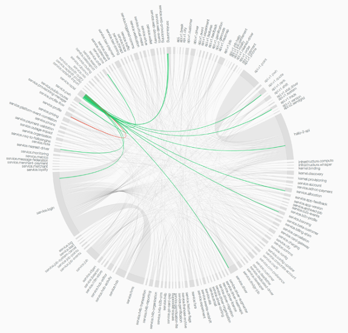
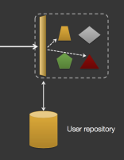
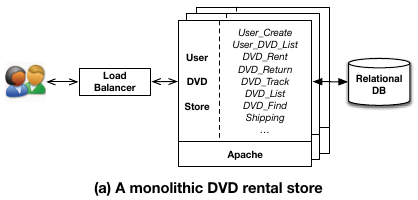
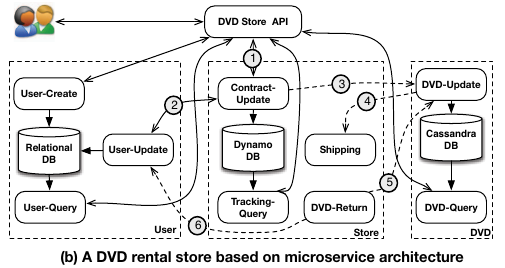
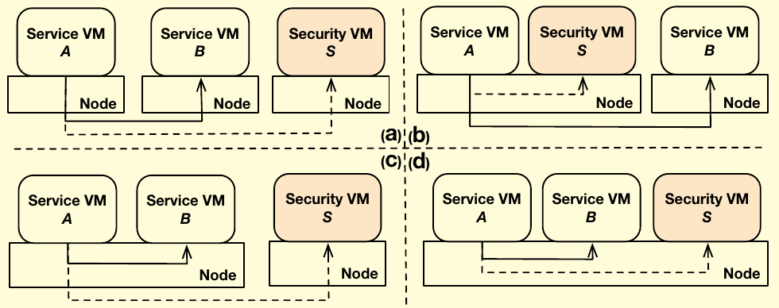

## Security in the Micro-Services Architecture
#### SR - Seminar

<small>Created by <a href="http://www.github.com/lucarin91">Luca Rinaldi</a></small>


## Microservices Architecture
Is an Architecture based of separeted services that implement a small part of the application.

They have to be autonomus (they can be deployed as a single machine, virtual machine, container or a process)


### Advantages
- Composability
- Scaling
- Resilience
- Technology Heterogeneity
- Ease of Deployment


### Introuced problems ( Disadvantages )
- Increased Resource use
- Increase Network communication
- Marshalling and Un marshalling
- Network Security

note:
- **Increased Resource** use - Initial investment to run these applications are high because all the independently running components need their own runtime containers with more memory and CPU.

- **Increase Network communication** - Independently running components interact with each other over a network. Such systems require reliable and fast network connections.

- **Marshalling and Un marshalling** - When one component needs data from another component, the sender marshals the data in some standard from its internal representation, while the receiver un-marshalls data into its own representation before use. This definitely requires more processing compared to conventional application architecture.

- **Network Security** - Inter Service Communication needs to be secured to avoid any inter communication security breach. Due to several moving parts, these applications are more prone to security vulnerabilities.


## Real-World Examples: [Hail](https://www.hailoapp.com)



## Security issue
- Authentication and Authorization
- Greater Surface Attack Area
- Heterogeneity
- Network Complexity
- Secure the comunications
- Trust


### Trust
we have in same way decide a compromise, at same point we have to trust and release part of the security to avoid to mutch overread.


### Authentication and Authorization

Each micro-services have to ensure that the request is made by an authenticated client with the corrent rigths.

to avoid repeted work the it can be used SSO Gatway that is the only one that communicate with the identity service.

After the sig-in it transmit to the other services a token authorize the client.

see: https://speakerdeck.com/dsyer/security-for-microservices-with-spring

#### Thecnologie
- OpenID
- SAML
- JWT


### Greater Surface Attack Area
in monolitic application all the component talk by internal data structure of the used language.

in the microservices infrastructure all serices expose common API independed from the programming language

(the services can in principle can be accessed by the external and in every order)


### Heterogeneity
The application can be made by a very large number of services that can also not be know in advance.
No common security infrastructure, different Trusted Computing Base


### Network Complexity
Such an intrinsic complexity
determines an ever-increasing difficulty in debugging, monitoring, auditing, and forensic
analysis of the entire application. Attackers could exploit this complexity to launch attacks
against applications.


### Secure the comunications
Are needed way to ensure that the comunication beteewn the services are secure.
Adopted tecnics:
- HTTPS
- Client Certificates
- HMAC Over HTTP


### Correct message flow
We have ensure trust between the services.
Also if we encrypt all the comunication and use certification to authenticate the service, that can be the possibility hat a compromised service act in a non consentit way an we encome in the..


### Confused deputy problem
the situation where a malicious party can trick a deputy service into making calls to a downstream service on his behalf
that he shouldn’t be able to.


### The DVD retail examples





### One possible problems


a compromised `Contract-Update` may send modified requests to `User-Update` to cause user account to be arbitrarily charged. A compromised `DVD-Update` service may consume and then delete messages on the queue without actually shipping out DVDs, causing a denial of service attack, and so on.


### Netflix vulnerability
As a real world example, a subdomain of Netflix was compromised, and from that domain, adversary can serve any content in the context of netflix.com. In addition, since Netflix allowed all users’ cookies to be accessed from any subdomain, an adversary controlling a subdomain was able to tamper with authenticated Netflix subscribers and their data.


### Monitor the network
In "Security-as-a-Service for Microservices-Based Cloud Applications" is proposed a solution that have to be
- Completeness
- Tamper
- Flexibility
- Efficiency

note:
- Completeness: the solution should be able to monitorand enforce over both internal and external networ events of a cloud application.
- Tamper resistance: the solution should work even if in-dividual application VMs are under adversary’s control.
- Flexibility: the solution should allow applications tospecify their own policies over the kind of networkevents they want to monitor and enforce policies on.
- Efficiency: the solution should have minimal impact onnetwork and CPU resources consumed.


### Design
Put the monitoring part outside the bussness logic.
Create security VM that can analyse and monitoring the flow coming from the application VM.

All the network event of the services can be redirect by the SDN of the cloud infrastructure.

note:
this solution is tamper-prof because the attacker can't access the security VM unless there is same vulnerability in the VM hypervaisor.


### FlowTap Primitive
To avoid scustom network configuration is possible to define a new primitive:
```
FlowTap (SRC, DST, Flow_Syntax, Action)
```

- **SRC**, the port of the source VM
- **DST**, the port of the destination VM
- **Flow_Syntax**, identifie a specific flow to tap  
- **Action**, forwarding or redirect

Flow_Syntax Example ( Monitor incoming HTTP requests ):
```(python)
nw_src = 0.0.0.0/0; nw_proto = TCP; tp_dst = 80 , redirect)
```

<!-- Flow_Syntax:
```java
in_port, dl_vlan, dl_vlan_pcp, dl_src, dl_dst, dl_type, nw_src,
nw_dst, nw_proto, nw_tos, nw_ecn, nw_ttl, tp_src, tp_dst,
icmp_type, icmp_code, table, metadata, vlan_tci, ip_frag,
arp_sha, arp_tha, ipv6_src, ipv6_dst, ipv6_label, nd_target,
nd_sll, nd_tll, tun_id, tun_src, tun_dst, reg
```

Action:
```python
forwording, redirection
``` -->

note:
- **forwarding**: relevant network events will be copied and forwarded to the security VM, with the original network events still delivered to their intended destination.
- **redirecting**: the relevant network events will be directed to the security VM, and depending the decisions made by security monitor, the network events may or may not reach the their intended destination.


### ftc compiler
A tool to traslate the policy written in Dalog to a set of FlowTap call.

It can also dynamically compile the same policy into different set of FlowTap calls that maximize the efficiency of the system, base on CPU usage and network load.


### Implementation
FlowTap is implemented on OpenStack Icehouse release.

By modifing the virtual routing devices on cloud nodes:
- the integration bridge (`br-int`) that connects to VMs
- the tunneling bridge (`br-tun`) that tunnels the VM traffic across cloud nodes.


### How it works
modified `br-int` such that when a packet of the target VM is submitted, it is processed through
the following steps according to the FlowTap API:
1. the flow is compared with the flow syntax;
2. if it matches, it is duplicated (if the action is forwarding) or taken as it is (if the action is redirecting);
3. its destination MAC address is rewritten to be the MAC of the security VM;
4. it is resubmitted to either a local port on `br-int` if the security VM is on the same cloud node, or to the `br-tun` for tunneling.


### Evalutation

<small>

| Scenario | (a) | (b) | (c) | (d) |
|:---------|:---:|:---:|:---:|:---:|
| Baseline (mbps) | 2600 | 2600 | 12000 | 12000 |
| FlowTap (mbps)  | 2100 | 2600 | 5100  | 9100  |
| Throughput loss | 19%  | 0%   | 57%   | 24%   |

</small>


### Netflix Fido
Application-based security approaches, such as in Netflix Fido analyze API-level behaviors within cloud applications to build application profiles and then use the profiles to detect anomalous patterns.

They, however, have two drawbacks:
- the analysis often uses hooks within the VM or the application to monitor the APIs and other application behaviors. If an adversary successfully compromises a microservice and escalates the privileges to control the VM that hosts the service, it can easily subvert the security of this framework.
- this approach usually lacks the visibility into the underlying infrastructure, thus may lack capability to respond to the conditions (e.g. they cannot redirect traffic by themselves and need some infrastructure support).

note:
Application-based security approaches, such as in Netflix Fido analyze API-level behaviors within cloud applications to build application profiles and then use the profiles to detect anomalous patterns. They, however, have two drawbacks. First, the analysis often uses hooks within the VM or the application to monitor the APIs and other application behaviors. If an adversary successfully compromises a microservice and escalates the privileges to control the VM that hosts the service, it can easily subvert the security of this framework. Second, this approach usually lacks the visibility into the underlying infrastructure, thus may lack capability to respond to the conditions (e.g. they cannot redirect traffic by themselves and need some infrastructure support).


### Conclusion
òdslfksldkf


## Thanks
